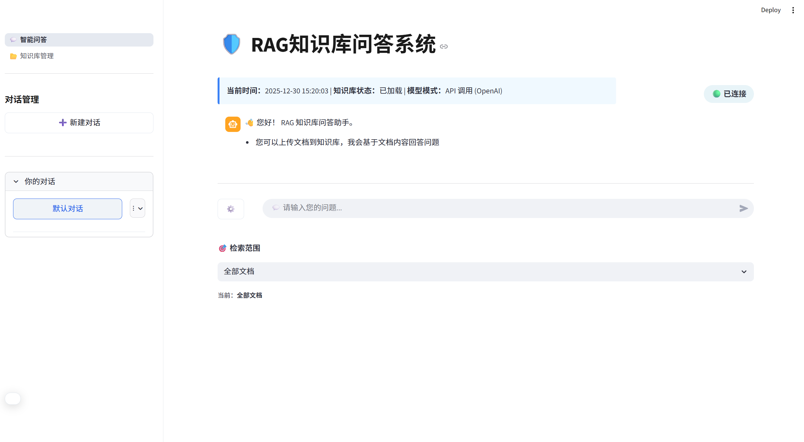
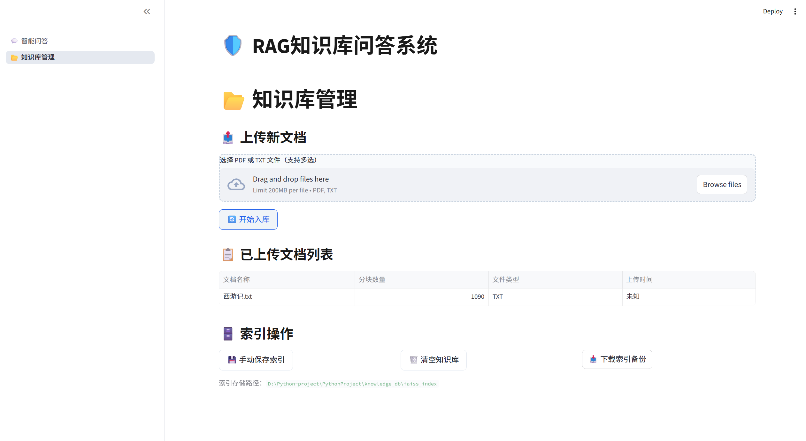

# RAG-KnowledgeBase


基于 LangChain + FAISS 的 RAG 知识库问答系统，支持文档上传、多对话管理、语义检索、来源溯源、Ollama 与 OpenAI 双模式，完全支持本地离线运行。

## 🌟 主要功能

- 📄 **文档上传**：支持 PDF / TXT（图片型 PDF 自动 OCR）
- 🔍 **智能检索**：bge-small-zh-v1.5 嵌入 + bge-reranker 重排序
- 💬 **多对话管理**：新建、重命名、删除、置顶、可折叠
- 📊 **来源溯源**：Top 5 结果展示 + 原文片段高亮
- ⚙️ **双模型支持**：OpenAI API 与本地 Ollama 无缝切换
- 🗂️ **知识库管理**：独立页面查看文档列表、备份、清空
- 🌐 **完全离线**：模型首次下载后本地缓存，后续无需网络

## 🖥️ 界面预览

<div align="center">

**智能问答页面（多对话 + 检索范围切换）**  


**知识库管理页面**  


</div>

> （截图待上传，运行项目后替换这里）

## 🚀 快速开始

```bash
# 克隆仓库
git clone https://github.com/Limitinfinitude/RAG-KnowledgeBase.git
cd RAG-KnowledgeBase

# 安装依赖
pip install -r requirements.txt
