<div align="center">

#  RAG-KnowledgeBase

**基于 LangChain + FAISS 的智能检索与问答知识库系统**


*文档上传 · 语义检索 · 多轮对话 · 来源溯源 · 双端部署 · 离线可用*

</div>

---

## ✨ 项目简介

RAG-KnowledgeBase 是一个功能完整的 **RAG（检索增强生成）知识库问答系统**。它能够将你的 PDF、Word、PPT、TXT、Markdown、CSV、HTML、Excel、图片（OCR）等 **12 种格式**文档构建为可语义检索的知识库，并通过大语言模型给出**带来源溯源的精准回答**。

系统提供**两套运行形态**，共享同一套核心检索与对话引擎：

| 形态 | 入口 | 适用场景 |
|------|------|----------|
| 🖥️ **Streamlit 单机版** | `streamlit run streamlit_app/app.py` | 本地个人知识库、快速体验 |
| 🌐 **Web 多用户版** | `python -m web_app.backend.dual_app` | 多账号、按用户隔离知识库、带管理后台 |

> 核心亮点：**支持本地离线运行**（嵌入/重排可用本地模型，LLM 可接本地 Ollama）；也可全云端化——嵌入走硅基流动 `BAAI/bge-m3`，重排走 `BAAI/bge-reranker-v2-m3`，LLM 走任意 OpenAI 兼容 API。

---

## 🌟 主要功能

### 核心能力

- 📄 **12 种格式统一解析**：PDF（扫描版自动 OCR）、DOCX、PPTX、TXT、MD、CSV、HTML、XLSX、XLS、JPG/PNG（OCR 入库），统一解析入口 `document_parsers`
- 🔍 **智能混合检索**：向量嵌入（本地 bge-small-zh / 云端 bge-m3）+ BM25（jieba v3 分词 + 词覆盖率门控）+ RRF 融合 + 双信号负样本防线
- 🏆 **重排序优化**：CrossEncoder 交叉编码重排（云端 bge-reranker-v2-m3 / 本地模型自动切换），概率阈值过滤 + 失败保序回退
- 🧩 **智能分块**：多层级分块（Small/Medium/Large）+ 父块扩展 + 合并去重
- 💬 **多对话管理**：新建、重命名、置顶、折叠、**全文搜索**、**批量删除/导出**、JSON/Markdown 双格式导出、Ctrl+K/N 快捷键，会话云端同步
- 📊 **来源溯源**：回答标注 `[来源 n]` + 原文片段高亮，杜绝无据幻觉；陷阱问题由 LLM 拒答层兜底（实测拒答正确率 0.98）
- 🧭 **意图识别**：智能区分闲聊与文档问答，默认走 RAG，避免误判
- ⚙️ **高级检索面板**（问答页）：结果重排开关、召回片段数 3-20、温度 0-2.0，开合状态记忆
- 🛡️ **OCR 二层回退**：本地 Tesseract（chi_sim+eng，跨平台自动探测）→ 硅基流动 DeepSeek-OCR 云端（手写/复杂表格/公式场景）
- 🔒 **并发写安全**：FAISS 进程内 RLock + 跨平台文件锁（flock/msvcrt），多线程/多进程入库不损坏索引

### 双模型支持

- ☁️ **OpenAI 兼容 API**：任意 OpenAI 风格 Base URL + API Key + 模型名
- 🦙 **本地 Ollama**：完全离线的本地大模型推理
- 🔄 管理端可维护多套 LLM 预设，无缝切换

### Web 端专有能力

- 👥 **多用户体系**：注册登录、JWT 会话（过期主动登出）、按用户隔离知识库目录、用户自助改密
- 🛡️ **管理后台**：用户管理（编辑/重置密码/禁用/注销）、文档总览与回收站、监控审计（四类日志）、功能开关、向量维护、系统设置、**好差评流水**（筛选/分页/CSV·JSON 导出）、提示词模板
- 💬 **反馈闭环**：用户提交意见反馈 → 管理员回复/状态流转 → 用户端「我的反馈」查看回复
- 📈 **联网检索**：可选 Brave / 博查 / 百度千帆联网搜索，补充实时信息
- ⚡ **大文件后台上传**：Service Worker + 入库队列，页面关闭不中断；**刷新/重开后自动恢复跟踪**未完成入库任务
- 🔐 **管理员注册邀请码**：设置 `ADMIN_REGISTER_CODE` 环境变量后，管理端注册须填邀请码
- 📦 **前端零外联**：marked/dompurify 等依赖本地化，内网环境可整套部署

---

## 🖼️ 界面预览

### 智能问答

<div align="center">

**知识库问答（多对话 + 检索范围切换 + 来源溯源）**

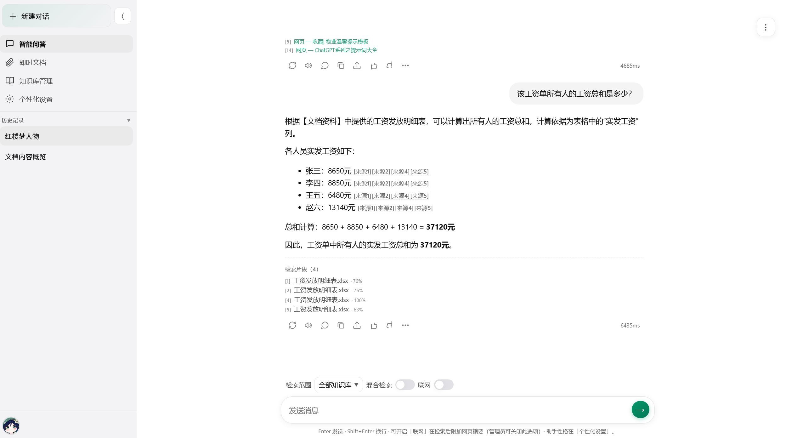

**即时文档问答（上传即问，无需入库）**

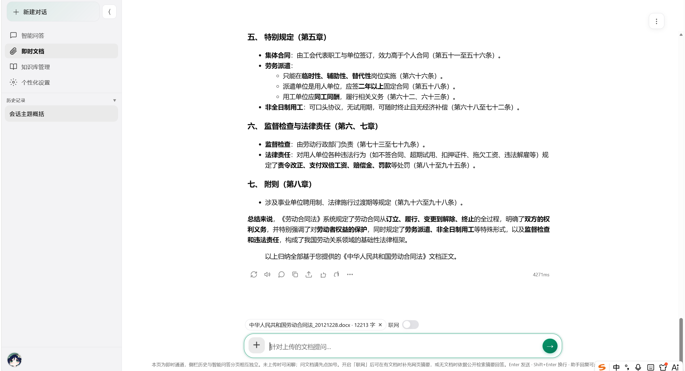

</div>

### 知识库与文档管理

<div align="center">

| 知识库管理 | 文档库管理 |
|:---:|:---:|
| 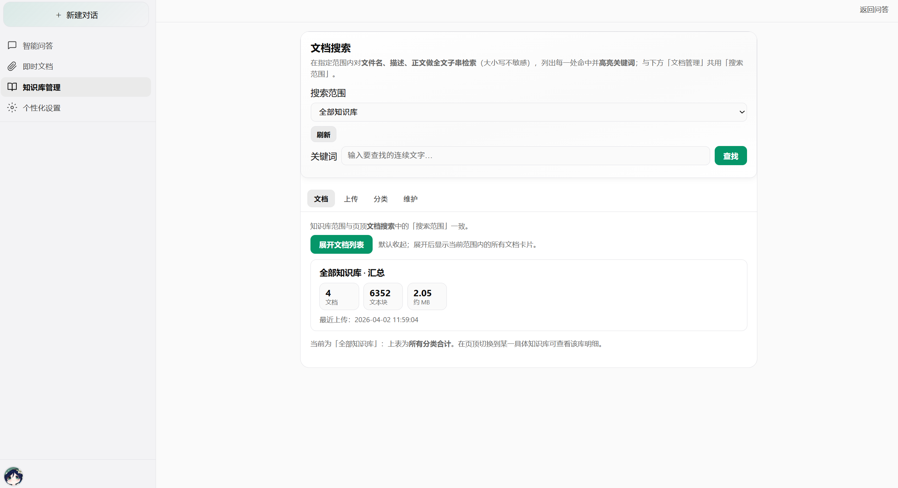 | 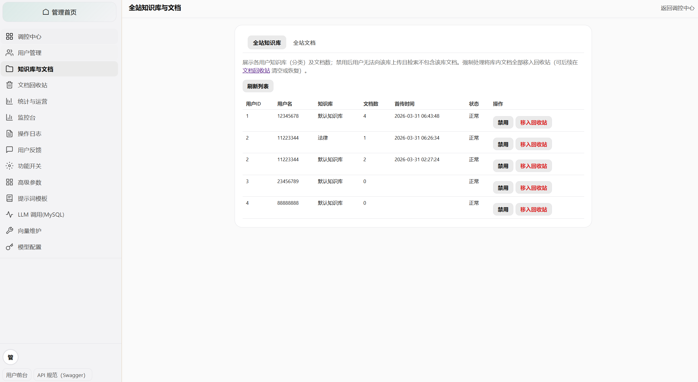 |

</div>

### 管理后台

<div align="center">

**管理端首页**  
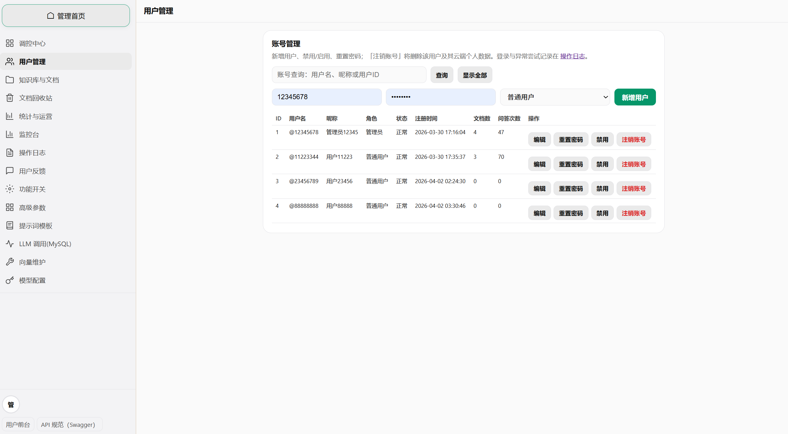

</div>

### 模型与参数配置

<div align="center">

| 模型设置 | 参数设置 |
|:---:|:---:|
| 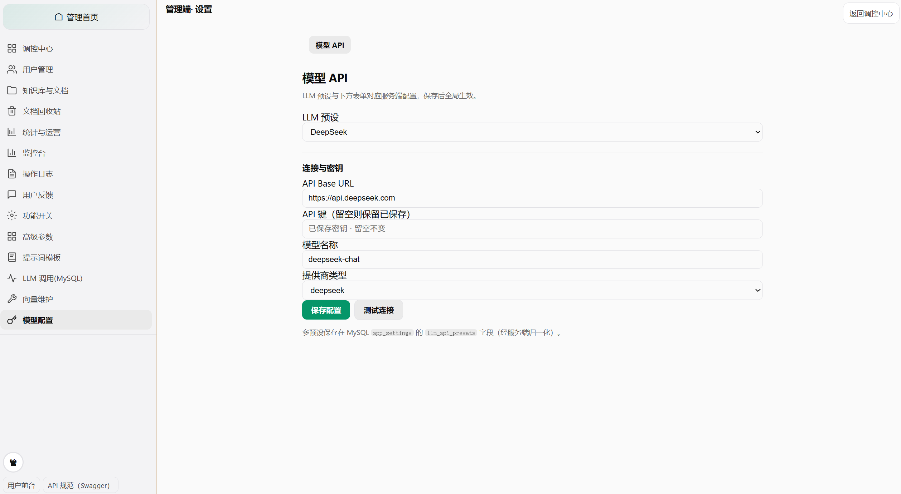 | 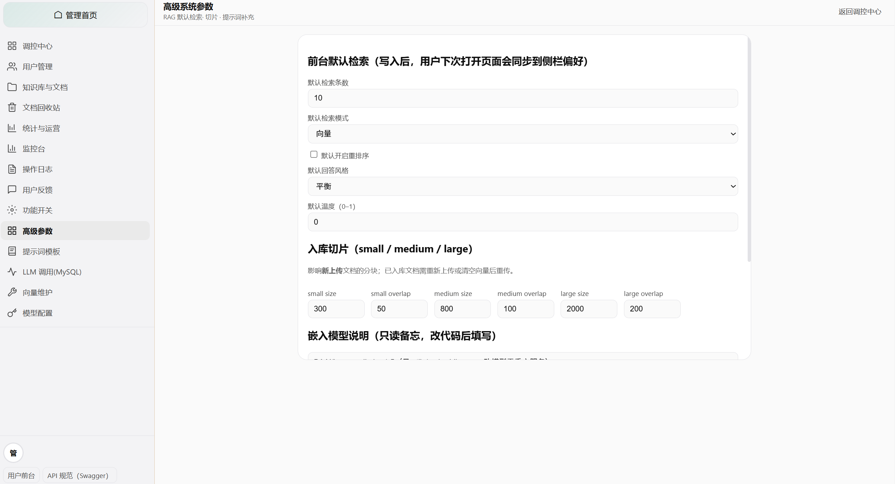 |

</div>

### 个性化与功能开关

<div align="center">

| 个性化设置 | 功能开关 |
|:---:|:---:|
| 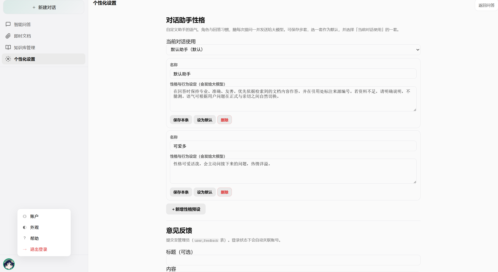 | 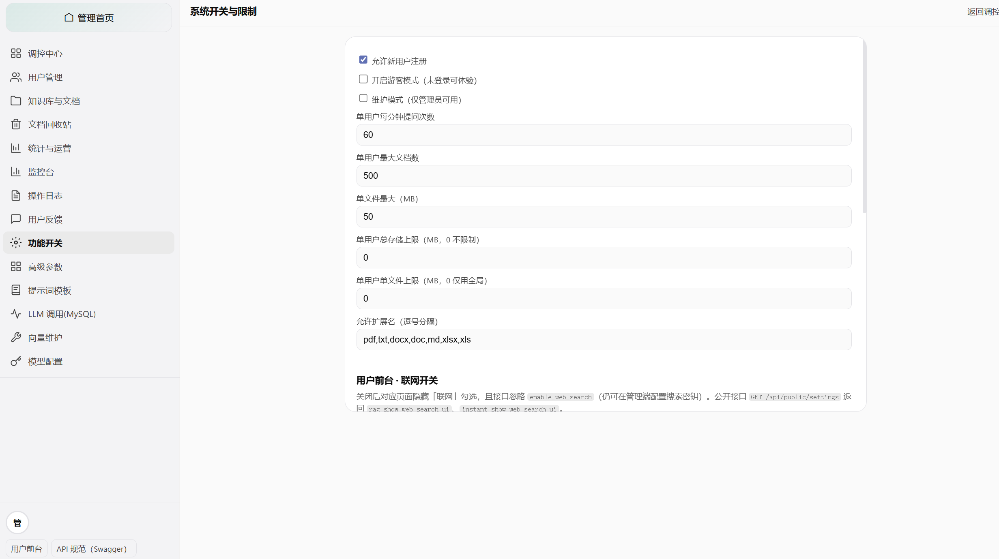 |

</div>

### 运维监控

<div align="center">

| 系统日志 | 向量维护 |
|:---:|:---:|
| 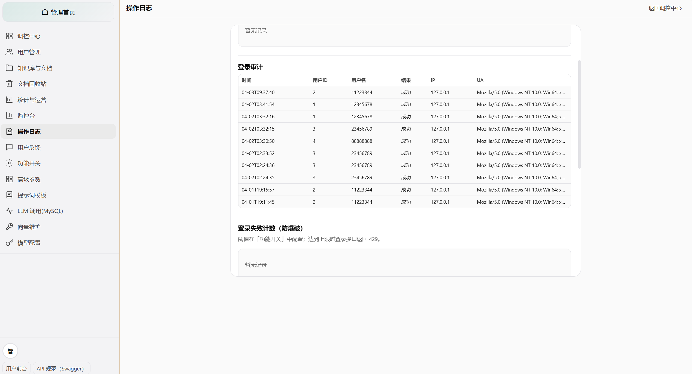 | 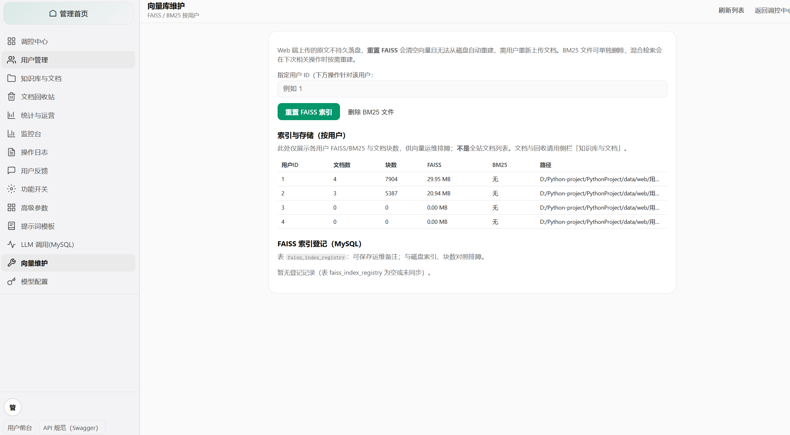 |

</div>

---

## 🚀 快速开始

### 环境要求

- **Python 3.10+**（推荐 3.11）
- **Tesseract OCR**（可选，用于图片型 PDF 识别）

### 1. 克隆仓库

```bash
git clone https://github.com/Limitinfinitude/RAG-KnowledgeBase.git
cd RAG-KnowledgeBase
```

### 2. 安装依赖

```bash
# 推荐：conda 环境（可复现）
conda env create -f environment.yml
conda activate rag_demo

# 或 pip（直接依赖，精确版本）
pip install -r requirements.txt
```

### 3. 配置密钥（config.json）

> 出于安全考虑，所有密钥统一存放在 `config.json`（启动读一次），不再硬编码。

```bash
# 复制模板并填写真实值（config.json 已被 .gitignore 忽略）
cp config.example.json config.json
```

`config.json` 关键项：

```json
{
  "mysql": { "password": "你的数据库密码" },
  "llm": { "base_url": "https://api.openai.com/v1", "api_key": "sk-你的密钥", "model": "gpt-4o-mini" },
  "deepseek": { "api_key": "sk-你的DeepSeek密钥", "model": "deepseek-chat" },
  "embedding": { "provider": "local", "model": "BAAI/bge-small-zh-v1.5" },
  "rerank": { "provider": "local", "model": "BAAI/bge-reranker-base" },
  "siliconflow": { "api_key": "", "base_url": "https://api.siliconflow.cn" },
  "search": { "brave": "", "bocha": "", "qianfan": "" }
}
```

> **云端推荐模型**（在管理端「向量维护」配置 provider，主存 MySQL 免重启）：嵌入 `BAAI/bge-m3`（**1024 维**，与旧 512 维索引不兼容，切换后须整体重建）、重排 `BAAI/bge-reranker-v2-m3`——硅基流动实测可用的两个模型；`bge-small-zh-v1.5` / `bge-reranker-base` 在硅基流动**不存在**，仅可本地跑。
>
> **配置优先级**：密钥/静态配置走 `config.json`（重启生效）；运行时业务配置（LLM 预设、检索参数、分块层级、开关、限流、向量 provider 选择）主存 MySQL `app_settings`，管理端**动态修改、免重启**。嵌入/重排支持本地与任意 OpenAI 兼容云端 API（硅基流动等），详见 `docs/DEPLOY.md`。

### 4. 启动

**方式 A：Streamlit 单机版**

```bash
streamlit run streamlit_app/app.py
```

浏览器访问 `http://localhost:8501`，享受本地个人知识库。

**方式 B：Web 多用户版（双端口）**

```bash
python -m web_app.backend.dual_app
```

| 站点 | 地址 |
|------|------|
| 用户站 | http://127.0.0.1:4010/ |
| 管理站 | http://127.0.0.1:4011/ |

> 默认端口可通过环境变量 `RAG_USER_PORT` / `RAG_ADMIN_PORT` 覆盖。

---

## 🗂️ 项目结构

```
RAG-KnowledgeBase/
├── streamlit_app/          # Streamlit 单机应用（5 个页面）
│   ├── app.py              # 入口
│   ├── pages/              # 知识库问答 / 文档问答 / 知识库管理 / 监控台 / 模型设置
│   └── components/         # 侧栏组件
│
├── web_app/                # Web 多用户应用（FastAPI + 静态前端）
│   ├── backend/            # 后端：路由、鉴权中间件、入库队列、向量缓存
│   │   └── routers/        # auth / admin / rag / public 接口分包
│   └── frontend/           # 前端：user / admin / shared 分离
│
├── services/               # 核心业务编排（双端复用）
│   ├── retrieval.py        # RAG 检索管线
│   ├── chat_turn.py        # 对话编排
│   ├── ingest.py           # 文档入库
│   └── llm_factory.py      # LLM 构造
│
├── utils/                  # 工具与领域模块
│   ├── hybrid_search.py    # BM25 + 向量 + RRF 混合检索
│   ├── reranker.py         # CrossEncoder 重排序
│   ├── smart_chunker.py    # 智能多层级分块
│   ├── path_context.py     # 多用户知识库路径隔离
│   └── ...
│
├── models/                 # 本地模型缓存（gitignored）
├── data/                   # 运行时数据（gitignored）
├── eval_corpus_v2/         # 评测语料 v2：155 文件权威公开数据基准（可复现）
├── scripts/                # 评测脚本：数据集构建 / 检索四模式 / 端到端 / 阈值敏感性
├── config.json             # 密钥与模型默认配置（gitignored）
├── config.example.json     # 配置模板
├── config.py               # 全局配置入口（启动读 config.json）
└── requirements.txt
```

---

## 🧠 技术栈

| 层级 | 技术 |
|------|------|
| **Web 框架** | FastAPI · Uvicorn · Starlette |
| **单机 UI** | Streamlit |
| **LLM 编排** | LangChain（ChatOpenAI / Ollama） |
| **向量库** | FAISS（进程内 + 跨进程写锁保护） |
| **嵌入模型** | 本地 BAAI/bge-small-zh-v1.5 · 云端 BAAI/bge-m3（1024 维，推荐） |
| **重排序模型** | 本地 bge-reranker CrossEncoder · 云端 BAAI/bge-reranker-v2-m3（推荐） |
| **混合检索** | rank-bm25 + jieba（v3 分词 + 词覆盖率门控）+ RRF 融合 |
| **OCR** | Tesseract（chi_sim+eng）→ 云端 DeepSeek-OCR 二层回退 |
| **认证** | SQLite / MySQL + Bearer Token（过期主动登出） |

---

## 🔍 检索流程

```
用户输入
  → 意图识别（闲聊 / RAG）
  → 查询类型分类 + 查询重写
  → 混合检索（BM25 + 向量 + RRF，词覆盖率门控抗弱词穿透）
  → 重排序（CrossEncoder 概率 + SIMILARITY_THRESHOLD 过滤）
  → 低分回退（无结果过阈值时保留少量低分片段，避免空手而归）
  → 父块扩展（Parent-Document Retrieval）→ 上下文拼装 → LLM 生成
  → 来源溯源与展示（资料不含答案时 LLM 拒答，双层防线）
```

### 检索质量评测（2026-08-19 · 权威公开数据基准）

评测集 **824 条查询 / 155 文档 / 4194 块**，主力为权威公开数据：DuReader-retrieval（百度 ACL 2022，真实搜索问句+人工标注）、CMRC 2018（维基人工标注问答）、中文维基完整长条目（LLM 生成问答+原文自检），另有自建多格式语料与 78 条负样本（纯负+对抗性陷阱）。构建全流程可复现（HF 镜像下载→转换→自检）。

| 维度 | 结果 |
|------|------|
| 正样本召回（生产全管线） | **Recall@5 = 0.989**（语料从 10 扩至 155 文档仅降 0.4pt） |
| 负样本误召回（重排严格口径） | **11.5%**；阈值敏感性显示 SIMILARITY_THRESHOLD 取 0.4 可降至 **5.1%**（正样本仅损失 0.7pt） |
| 端到端（80 正 + 20 陷阱负） | Faithfulness **0.995** · Answer Correctness(对权威GT) **0.938** · Context Recall **0.957** · 拒答正确性 **0.980** |
| 延迟 | 检索 p50 2.2s（云端重排占大头）· 生成 p50 2.0s |

```bash
# 构建评测集与评测库（可复现）
python -X utf8 scripts/build_eval_dataset_v2.py
python -X utf8 scripts/build_eval_kb_20260815.py --user 99 --corpus eval_corpus_v2 --reset
# 检索四模式（vector / hybrid / rerank / prod 生产口径）
python -X utf8 scripts/eval_retrieval.py --user 99 --set v2 --mode all
# 阈值敏感性（一次重排多阈值重放）/ 端到端六指标 + 延迟
python -X utf8 scripts/eval_threshold_sensitivity.py
python -X utf8 scripts/eval_e2e_ragas_style.py --sample 80 --negative-n 20
```

完整报告：[`docs/eval_report_20260819.md`](docs/eval_report_20260819.md)。

---

## 🛠️ 工程化

| 能力 | 说明 |
|------|------|
| 密钥治理 | 密钥走 `config.json`（`.gitignore` 忽略），`config.example.json` 提供模板 |
| 依赖锁定 | `requirements.lock.txt` + `environment.yml` 可复现 |
| 并发写安全 | FAISS 进程内可重入锁 + 跨平台文件锁；实测 10 并发混合格式入库 0 失败 |
| 单元测试 | **99 个用例**（解析器 / 检索链路 / 重排回退 / 分词门控 / 写锁 / 硅基流动客户端 / 查询分类），`pytest` 运行 |
| CI | GitHub Actions 自动跑测试 |

```bash
pytest -q          # 运行全部测试
```

---

## 📄 开源与贡献

欢迎 Star ⭐、Fork 与 PR，一起完善这个项目！如有问题或建议，请提交 [Issue](https://github.com/Limitinfinitude/RAG-KnowledgeBase/issues)。

> 部署细节见 [`docs/DEPLOY.md`](docs/DEPLOY.md)。

---

<div align="center">

**如果这个项目对你有帮助，请给一个 Star ⭐ 支持一下！**

</div>
